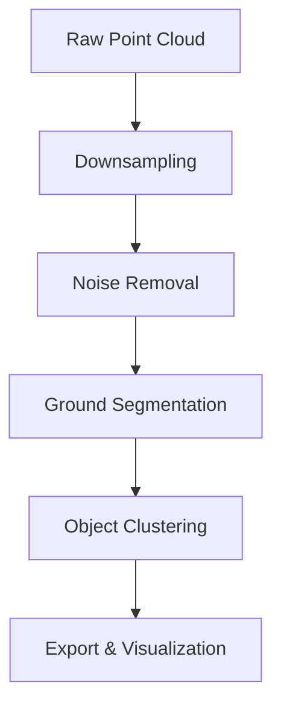
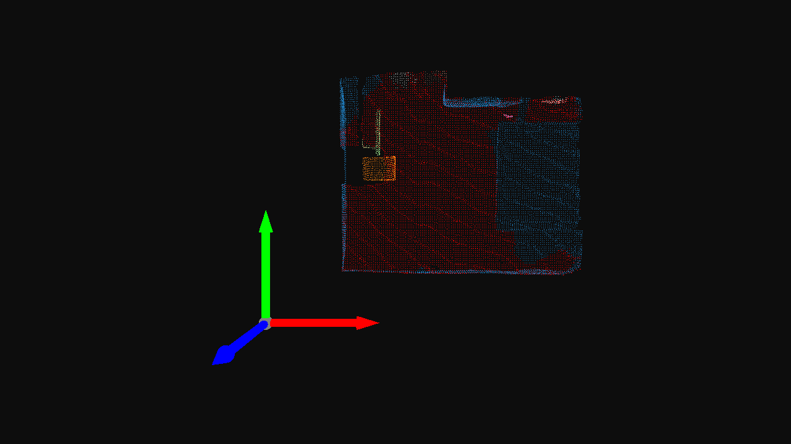
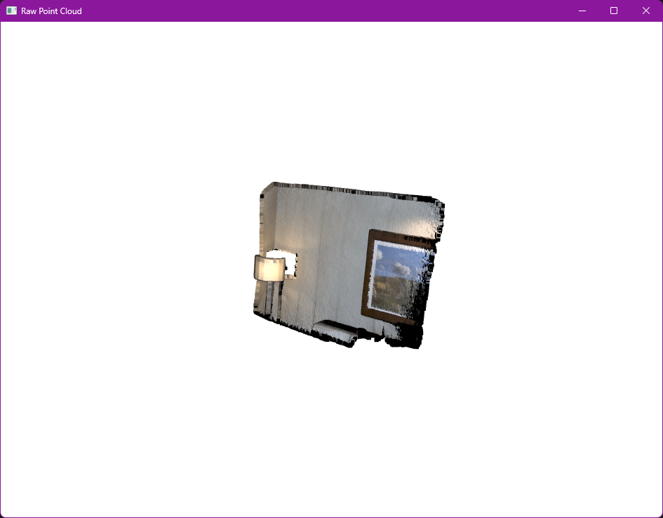

# Lidar Perception Pipeline


This project implements a small perception pipeline for processing raw 3D Lidar point cloud data.
It performs downsampling, noise filtering, ground segmentation, and object clustering using classical geometric algorithms.
The goal is to demonstrate practical understanding of 3D data structures and to build a clean, modular processing workflow.

---

## Why This Project Exists

This is not a product or an end-user tool.

It was developed as a **hands-on engineering study** to learn the fundamentals of point cloud processing and to build a minimal but complete 3D perception pipeline from scratch.

The focus was on:
- Understanding how raw sensor-like 3D data behaves,
- Applying the core geometric steps used in real perception systems,
- Organizing the code as a maintainable OOP pipeline,
- And producing reproducible outputs that show each stage clearly.

This project reflects the ability to pick up a new domain quickly, understand its basic operations, and implement them in a clear and controlled manner — skills directly relevant to computer vision, robotics, and spatial computing roles.

---

## Pipeline Overview



-----

## Methods Used

### 1. Downsampling (Voxel Grid)
Reduces point density for faster processing while keeping geometry intact.

### 2. Statistical Outlier Removal (SOR)
Removes isolated points based on neighborhood statistics.

### 3. RANSAC Plane Fitting
Extracts the dominant plane (ground) from the scene.

### 4. DBSCAN Clustering
Groups non-ground points into object clusters without requiring a fixed number of clusters.

-----

## Results
### Processed Output



### Visuals

| Raw Input | Processed Output |
| :---: | :---: |
| *Raw Point Cloud* | *Segmented Objects & Ground* |
|  |  |

### Sample Metrics

- **Noise reduction:** ~2.3%
- **Detected object clusters:** 7

> Values depend on the dataset and configuration.

-----

## Usage

1. **Clone the repository:**
```bash
git clone https://github.com/asmarufoglu/spatial-comp-lab.git
cd spatial-comp-lab/lidar-denoiser
```

2. **Install dependencies:**
```bash
pip install -r ../requirements.txt
```

3. **Run the pipeline:**
```bash
python main.py
```

Processed `.pcd` files will be saved in the `output/` directory.

---

## Code Structure

```python
processor = LidarProcessor(config)
(
    processor
    .load_data()
    .pre_process()
    .remove_noise()
    .segment_ground()
    .cluster_objects()
    .save_results()
    .visualize()
)
```

- `LidarConfig`: Stores all pipeline parameters.
- `LidarProcessor`: Implements each stage.
- `output/`: Stores generated point clouds.

---

## Technologies

- Python 3.10  ()
- Open3D  
- NumPy  
- Matplotlib  

---
## 🎥 Demo

A short preview of the perception pipeline in action:


## Notes

This project is part of a broader study on spatial computing and 3D perception workflows.
